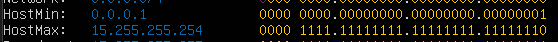
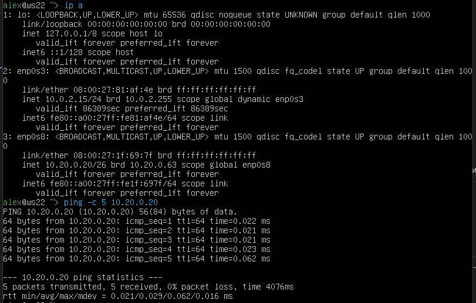

## Part 1. Инструмент ipcalc

### 1.1 Сети и маски

### 1.1.1 Адрес сети 192.167.38.54/13

### 1.1.2 Перевод маски 255.255.255.0 в префиксную и двоичную запись

/15 в обычную и двоичную

11111111.11111111.11111111.11110000 в обычную и префиксную

### 1.1.3 Минимальный и максимальный хост в сети 12.167.38.4 при масках:

- /8

- 11111111.11111111.00000000.00000000

- 255.255.254.0

- /4

### 1.2 localhost

Для localhost зарезервирован диапазон ip 127.0.0.1 - 127.255.255.254. Поэтому обратиться к приложению, работающем на localhost с IP 194.34.23.100 и 128.0.0.1 мы не сможем, тогда как к IP 127.0.0.2 и 127.1.0.1 сможем.

### 1.3 Диапазоны и сегменты сетей

### 1.3.1 Диапазоны частных "серых" ip-адресов: \

10.0.0.0 - 10.255.255.255 \
172.16.0.0 - 172.31.255.255 \
192.168.0.0 - 192.168.255.255

Поэтому:

10.0.0.45 - Частный \
192.168.4.2 - Частный \
172.20.250.4 - Частный \
172.16.255.255 - Частный \
10.10.10.10 - Частный \
134.43.0.2 - Публичный \
172.0.2.1 - Публичный \
192.172.0.1 - Публичный \
172.68.0.2 - Публичный \
192.169.168.1 - Публичный

### 1.3.2 Шлюзы, возможные у сети 10.10.0.0/18:

10.10.0.2 \
10.10.10.10 \
10.10.1.255

---

## Part 2. Статическая маршрутизация между двумя машинами

### 2.0.1 Смотрим существующие сетевые интерфейся с помощью команды <b>ip a</b>

Для ws1:

Для ws2:

### 2.0.2 Описать сетевой интерфейс, соответствующий внутренней сети, на обеих машинах и задать следующие адреса и маски: ws1 - 192.168.100.10, маска /16, ws2 - 172.24.116.8, маска /12.

- Сетевой интерфейс для внутренней сети - enp0s8.

Скрин для изменённого файла etc/netplan/00-installer-config.yaml - ws1:

Скрин для изменённого файла etc/netplan/00-installer-config.yaml - ws2:

### 2.0.3 Выполнить команду netplan apply для перезапуска сервиса сети

Для ws1:

Для ws2:

### 2.1 Добавление статического маршрута вручную

### 2.1.1 Добавить статический маршрут от одной машины до другой и обратно при помощи команды вида ip r add

Для ws1:

Для ws2:

### 2.1.2 Пропинговать соединение между машинами

Для ws1:

Для ws2:

### 2.2 Добавление статического маршрута с сохранением

### 2.2.1 Добавить статический маршрут от одной машины до другой с помощью файла etc/netplan/00-installer-config.yaml

Для ws1:

Для ws2:

### 2.2.2 Пропинговать соединение между машинами

Для ws1:

Для ws2:

## Part 3. Утилита <b>iperf3</b>

### 3.1 Скорость соединения

Перевести и записать в отчёт: 8 Mbps в MB/s, 100 MB/s в Kbps, 1 Gbps в Mbps:

- 8 Mbps = 1 MS/s.
- 100 MB.s = 100000 Kbps.
- 1 Gbps = 1000 Mbps.

### 3.2 Утилита iperf3

Измерить скорость соединения между ws1 и ws2

ws1 Server:

ws2 Server:

## Part 4. Сетевой экран

### 4.1 Утилита <b>iptables</b>

### 4.1.1 Нужно добавить в файл подряд следующие правила:

1. на ws1 применить стратегию когда в начале пишется запрещающее правило, а в конце пишется разрешающее правило (это касается пунктов 4 и 5)

2. на ws2 применить стратегию когда в начале пишется разрешающее правило, а в конце пишется запрещающее правило (это касается пунктов 4 и 5)

3. открыть на машинах доступ для порта 22 (ssh) и порта 80 (http)

4. запретить echo reply (машина не должна "пинговаться”, т.е. должна быть блокировка на OUTPUT)

5. разрешить echo reply (машина должна "пинговаться")

Для ws1:

Для ws2:

### 4.1.2 Запустить файлы на обеих машинах командами `chmod +x /etc/firewall.sh` и `/etc/firewall.sh`

Для ws1:

Для ws2:

Разница в стратегиях заключается в том, что изначально в машине ws-1 мы сначала разрешаем, а после запрещаем вывод ping'a. В машине ws2 всё ровным счетом наоборот.

### 4.2. Утилита <b>nmap</b>

Командой ping найти машину, которая не "пингуется", после чего утилитой nmap показать, что хост машины запущен

## Part 5. Статическая маршрутизация сети

### 5.1. Настройка адресов машин

### 5.1.1 Настроить конфигурации машин в etc/netplan/00-installer-config.yaml согласно сети на рисунке.

r1:

r2:

ws11:

ws22:

ws21:

### 5.1.2 Перезапустить сервис сети. Если ошибок нет, то командой ip -4 a проверить, что адрес машины задан верно. Также пропинговать ws22 с ws21. Аналогично пропинговать r1 с ws11.

r1 to ws11:

ws11 to r1:

r2:

ws21 to ws22:

ws22 to ws21:

### 5.2. Включение переадресации IP-адресов.

### 5.2.1 Для включения переадресации IP, выполните команду на роутерах: `sysctl -w net.ipv4.ip_forward=1`

r1:

r2:

### 5.2.2 Откройте файл /etc/sysctl.conf и добавьте в него следующую строку: `net.ipv4.ip_forward = 1`

r1:

r2:

### 5.3. Установка маршрута по-умолчанию

### 5.3.1 Настроить маршрут по-умолчанию (шлюз) для рабочих станций. Для этого добавить default перед IP роутера в файле конфигураций

ws11:

ws21:

ws22:

### 5.3.2 Вызвать ip r и показать, что добавился маршрут в таблицу маршрутизации

ws11:

ws21:

ws22:

### 5.3.3 Пропинговать с ws11 роутер r2 и показать на r2, что пинг доходит. Для этого использовать команду:

ws11 to r2:

tcpdump -tn -i enp0s9 на r2:

### 5.4. Добавление статических маршрутов

### 5.4.1 Добавить в роутеры r1 и r2 статические маршруты в файле конфигураций. Пример для r1 маршрута в сетку 10.20.0.0/26:

r1:

r2:

### 5.4.2 Вызвать ip r и показать таблицы с маршрутами на обоих роутерах.

r1:

r2:

### 5.4.3 Запустить команды на ws11: `ip r list 10.10.0.0/[маска сети] и ip r list 0.0.0.0/0`

ws11:

В отчете выбран путь отличный от 10.10.0.0 потому что этот адрес указывает на все адреса.

### 5.5 Построение списка маршрутизаторов

### 5.5.1 Запустить на r1 команду дампа: `tcpdump -tnv -i eth0`

### 5.5.2 При помощи утилиты traceroute построить список маршрутизаторов на пути от ws11 до ws21

Путь строиться от узла к узлу до того момента, покаа не будет достигнута конечная точка. Каждый пакет проходит на своем пути определенное количество узлов, пока достигнет своей цели. На каждом узле добавляется счетчик, который отслеживает количество пройденых узлов.

### 5.6. Использование протокола ICMP при маршрутизации

### 5.6.1 Запустить на r1 перехват сетевого трафика, проходящего через eth0 с помощью команды: `tcpdump -n -i eth0 icmp`

### 5.6.2 Пропинговать с ws11 несуществующий IP (например, 10.30.0.111) с помощью команды: `ping -c 1 10.30.0.111`

## Part 6. Динамическая настройка IP с помощью DHCP

### 6.0.1 Для r2 настроить в файле /etc/dhcp/dhcpd.conf конфигурацию службы DHCP:

Указать адрес маршрутизатора по-умолчанию, DNS-сервер и адрес внутренней сети.

в файле resolv.conf прописать nameserver 8.8.8.8.

### 6.0.2 Перезагрузить службу DHCP командой systemctl restart isc-dhcp-server. Машину ws21 перезагрузить при помощи reboot и через ip a показать, что она получила адрес. Также пропинговать ws22 с ws21.

### 6.0.3 Указать MAC адрес у ws11, для этого в etc/netplan/00-installer-config.yaml надо добавить строки: macaddress: 10:10:10:10:10:BA, dhcp4: true

### 6.0.4 Для r1 настроить аналогично r2, но сделать выдачу адресов с жесткой привязкой к MAC-адресу (ws11). Провести аналогичные тесты

### 6.0.5 Запросить с ws21 обновление ip адреса

ws21 до:

ws21 после:

Использовал:

sudo dhclient -v \
sudp dhclietn -r \
sudo dhclient -v

## Part 7. NAT

### 7.1 В файле /etc/apache2/ports.conf на ws22 и r1 изменить строку Listen 80 на Listen 0.0.0.0:80, то есть сделать сервер Apache2 общедоступным

### 7.2 Запустить веб-сервер Apache командой service apache2 start на ws22 и r1

r1:

ws22:

### 7.3 Добавить в фаервол, созданный по аналогии с фаерволом из Части 4, на r2 следующие правила:

1. Удаление правил в таблице filter - iptables -F

2. Удаление правил в таблице "NAT" - iptables -F -t nat

3. Отбрасывать все маршрутизируемые пакеты - iptables --policy FORWARD DROP

Проверить соединение между ws22 и r1 командой ping

При запуске файла с этими правилами, ws22 не должна "пинговаться" с r1

4. Разрешить маршрутизацию всех пакетов протокола ICMP

Проверить соединение между ws22 и r1 командой ping

При запуске файла с этими правилами, ws22 должна "пинговаться" с r1

Добавить в файл ещё два правила:

5. Включить SNAT, а именно маскирование всех локальных ip из локальной сети, находящейся за r2 (по обозначениям из Части 5 - сеть 10.20.0.0)
   Совет: стоит подумать о маршрутизации внутренних пакетов, а также внешних пакетов с установленным соединением

6. Включить DNAT на 8080 порт машины r2 и добавить к веб-серверу Apache, запущенному на ws22, доступ извне сети
   Совет: стоит учесть, что при попытке подключения возникнет новое tcp-соединение, предназначенное ws22 и 80 порту

Проверить соединение по TCP для SNAT, для этого с ws22 подключиться к серверу Apache на r1 командой:
telnet [адрес] [порт]

Проверить соединение по TCP для DNAT, для этого с r1 подключиться к серверу Apache на ws22 командой telnet (обращаться по адресу r2 и порту 8080)

## Part 8. Дополнительно. Знакомство с SSH Tunnels

Запустить веб-сервер Apache на ws22 только на localhost (то есть в файле /etc/apache2/ports.conf изменить строку Listen 80 на Listen localhost:80)

Воспользоваться Local TCP forwarding с ws21 до ws22, чтобы получить доступ к веб-серверу на ws22 с ws21

`ssh -L local_port:remote_ip:remote_port user@hostname`

Воспользоваться Remote TCP forwarding c ws11 до ws22, чтобы получить доступ к веб-серверу на ws22 с ws11

`ssh -R remote_port:local_ip:local_port user@hostname`

Для проверки, сработало ли подключение в обоих предыдущих пунктах, перейдите во второй терминал (например, клавишами Alt + F2) и выполните команду: `telnet 127.0.0.1 [локальный порт]`

ws11:

ws21:

